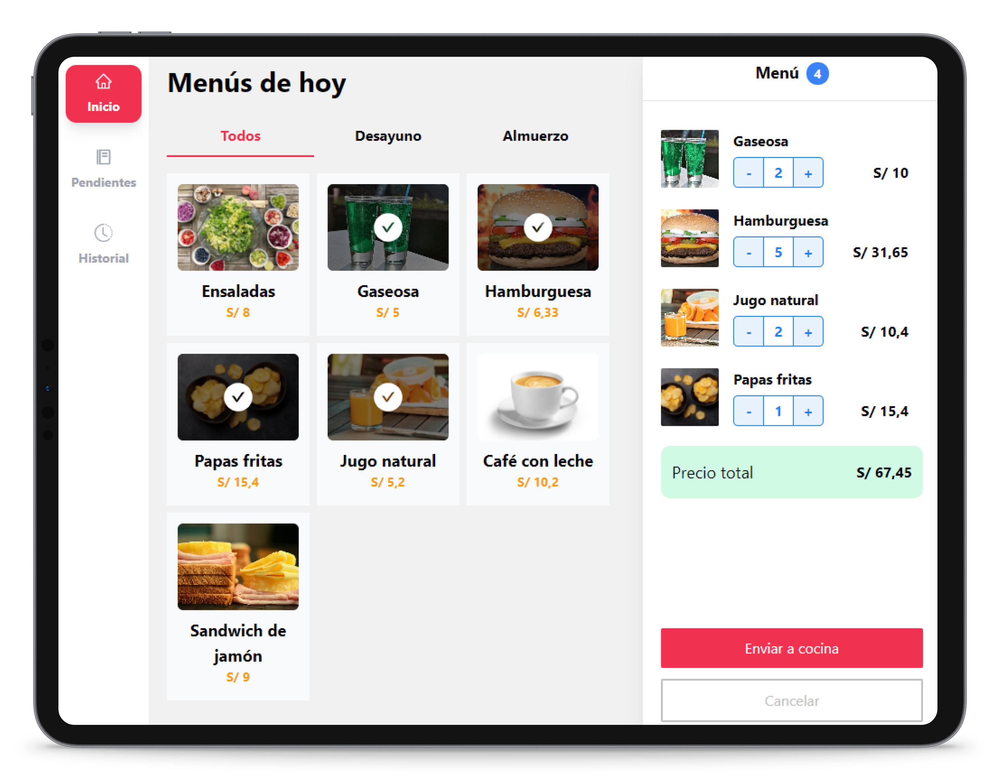

# Esquina Caliente



[Ver demo](http://esquina-caliente.surge.sh)

## Descripción 🚀
El proyecto fué desarrollado siguiendo las consideraciones dadas.
Los datos que se muestran en pantalla son obtenidos de un json localmente el cuál se puede reemplazar por un servicio externo.

Para llevar a cabo este proyecto se realizó bocetos y la identificación del flujo más optimo que debe realizar el usuario.

> Para poder iniciar sesión utilize la siguiente cuenta de prueba: ***usuario: admin@gmail.com y contraseña: admin***

La estructura de la aplicación es la siguiente.

El la carpeta **core** es donde se tiene toda la información para acceder a servicios externos ya sea una API, sistemas de autenticación, datos de prueba, etc. 

Los hooks que son reusables globalmente ya sea usando el store se encuentran en la carpeta **hooks**.

La carpeta **routes** maneja todas las pantallas principales como:
* Dashboard: Pantalla principal.
* GetStartedScreen: Dar bienvenida al usuario por única vez.
* LoginScreen: Iniciar sesión antes de ingresar al sistema principal.

Los componentes globales y funciones ayudantes se encuentran alojadas en la carpeta **shared**.

El flujo principal para mantener todos los datos actualizados está dentro de la carpeta **store** cual fué desarrollada con Redux.

En **modules** se ubica una serie de funcionalidades complejas pero independientes. Si se desea lleva a una sola pantalla, insertar sus componentes será totalmente sencillo.

Las pantallas donde vive su logica se encuentra en **screens** dentro cada uno tiene sus propios componentes, hooks y otras utilidades que solo serán usadas en ese paquete.

```
├───core
│   ├───data
│   ├───entities
│   └───services
├───hooks
├───modules
│   ├───AllFoods
│   ├───CreateNewOrderToCustomer     
│   ├───CurrentOrderMenu
│   └───Payments
├───routes
├───screens
│   ├───DashboardScreen
│   │   ├───routes
│   │   └───views
│   │       ├───RootScreens
│   │       │   ├───HistoryOrdersScreen
│   │       │   ├───HomeProductsScreen
│   │       │   └───PendingOrdersScreen
│   │       └───SidebarNavigation
│   ├───GetStartedScreen
│   └───LoginScreen
├───shared
│   ├───components
│   └───utils
├───store
│   ├───authentication
│   ├───foods
│   └───orders
└───styles
```

## Pre-requisitos 📋
Para comenzar el programa es necesario tener instalado Node>=10, Docker y docker-compose.
Aquí dejo los enlaces de descarga de los siguiente recursos por si aún no tienes algún programa.
* [Node](https://nodejs.org/en/download/)
* [Docker](https://docs.docker.com/docker-for-windows/install/)

## Tecnologías 🛠️
Las principales tecnologías usadas para la implementación del proyecto son las siguientes:

<a href="https://reactjs.org/" target="_blank">

</a>
<a href="https://www.typescriptlang.org/" target="_blank">

</a>
<a href="https://tailwindcss.com/" target="_blank">

</a>
<a href="https://redux-toolkit.js.org/" target="_blank">

</a>
<a href="https://material-ui.com/" target="_blank">

</a>
<a href="https://www.figma.com/" target="_blank">

</a>
<a href="https://jestjs.io/" target="_blank">

</a>
<a href="https://docs.docker.com/compose/" target="_blank">

</a>


## Uso ⚙️

Los siguientes comandos han de ser ejecutados dentro de la carpeta del proyecto.


**Uso con npm-scripts**

Antes de poder usar el proyecto es necesario instalar las dependencias.

```console
$ npm install
```

Para poder ver el funcionamiento en desarrollo ejecutar el siguiente comando.

```console
$ npm start
```

Si desea ejecutar las pruebas del sistema es necesario escribir el siguiente comando. 

```console
$ npm run test
```


Finalmente para poder construir la aplicación utilize el siguiente comando que creará una carpeta **build** done estará todo el código listo para producción.
```console
$ npm run build
```

**Uso con docker**

Para usar con docker es necesario ejecutar los siguientes comandos.

```console
$ npm run docker:image
```

```console
$ npm run docker:compose
```

Luego navegar a la siguiente url [http://localhost:5000](http://localhost:5000) en su navegador preferido.

## Funcionalidades desarrolladas
* [x] Inicio de sesión
* [x] Ingresar nombre del cliente.
* [x] Filtrar menú por desayuno y resto del día.
* [x] Agregar ítem al pedido.
* [x] Eliminar ítem del pedido.
* [x] Mostrar resumen de pedido con todos los items y el total.
* [x] Enviar a cocina y guardar el pedido.
* [x] Vista de pedidos pendientes.
* [x] Marcar pedido como listo.
* [x] Ver historial de pedidos.

Hay ciertas partes que se hubiera mejorado, por temas de tiempo no se terminó, sin embargo fué un gran reto 😊.